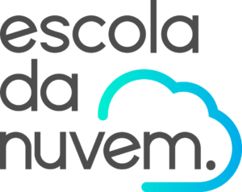

    

Este repositório contém minhas respostas de atividades relacionadas ao curso Re/Start AWS no módulo de IA na [Escola da Nuvem](https://escoladanuvem.org/), ministrada pelo colaborador [Rafael Santos](https://www.linkedin.com/in/rafasantosbzr/).

## Estrutura do Repositório

Abaixo está a estrutura de pastas principal e uma breve descrição do que você pode encontrar em cada uma:

- **`Prática 01`**:
    - [Questão 01](./pratica-1/atv-1/)
    - [Questão 02](./pratica-1/atv-2/)
    - [Questão 03](./pratica-1/atv-3/)
    - [Questão 04](./pratica-1/atv-4/)
- **`Prática 02`**
    - [Questão 01](./pratica-2/atv-1/)
    - [Questão 02](./pratica-2/atv-2/)
    - [Questão 03](./pratica-2/atv-3/)
    - [Questão 04](./pratica-2/atv-4/)
- **`Prática 03`**
    - [Questão 01](./pratica-3/atv-1/)
    - [Questão 02](./pratica-3/atv-2/)
    - [Questão 03](./pratica-3/atv-3/)
    - [Questão 04](./pratica-3/atv-4/)
- **`Prática 04`**
    - [Questão 01](./pratica-4/atv-1/)
    - [Questão 02](./pratica-4/atv-2/)
    - [Questão 03](./pratica-4/atv-3/)
    - [Questão 04](./pratica-4/atv-4/)

    <h2>Que a força do conhecimento nos conecte!</h2>

